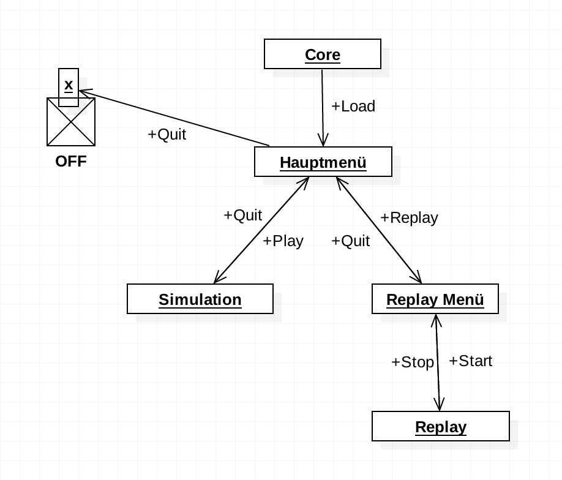
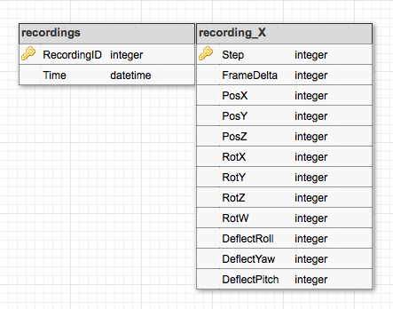

## Inhaltsverzeichnis

1. [Gliederung][1.]
2. [Klassen][2.]
	* [engine][2.1.]
	* [engine/resource][2.2.]
	* [engine/common3d][2.3.]
	* [engine/common3d/resource][2.4.]
	* [engine/common3d/behaviour][2.5.]
	* [scenario][2.6.]
	* [scenario/menu][2.7.]
	* [scenario/simulation][2.8.]
	* [scenario/replaymenu][2.9.]
	* [scenario/replay][2.10.]
	* [view][2.11.]
	* [view/airplane][2.12.]
	* [view/ground][2.13.]
	* [view/skybox][2.14.]
3. [Diagramme][3.]
	1. [Programmablauf][3.1.]
4. [SQL][4.]
	1. [Tabelle recordings][4.1.]
	2. [Tabelle recording_X][4.2.]

## 1. Gliederung

Ich habe diese Unterteilung in Pakete entworfen.

Engine:
* [`engine`][2.1.]
	* [`resource`][2.2.]
	* [`common3d`][2.3.]
		* [`resource`][2.4.]
		* [`behaviour`][2.5.]

Aero EXTREM:
* [`scenario`][2.6.]
	* [`menu`][2.7.]
	* [`simulation`][2.8.]
	* [`replaymenu`][2.9.]
	* [`replay`][2.10.]
* [`view`][2.11.]
	* [`airplane`][2.12.]
	* [`ground`][2.13.]
	* [`skybox`][2.14.]

Die `engine` wird in eine seperate .jar-Datei kompiliert,
um Modularität zu erzwingen. `scenario` und `view` sind
von der `engine` abhängig und können nicht alleine 
gestartet werden.

## 2. Klassen

Anmerkung: Die Methodensignaturen sind syntaktisch nicht korrekt.

### Paket `engine`: Resourcenverwaltung, Abstraktion

* Paket `engine/resource`: Resourcenverwaltung
* Paket `engine/common3d`: Abstraktes 3D-Szenario
* Klasse `Core`
	* Main-Klasse
	* Initialisiert die Anwendung (Lädt Resourcenverwaltung)
	* Verwaltet Szenarien
	* Lädt das Szenario, dass durch die Kommandozeile angegeben wird. 
	  (Classpath, Wird per Java Relection API geladen.)

### Paket `engine/resource`: Resourcenverwaltung

* Klasse `ResourceManager`
	* Hat Referenzen zu allen geladenen Resourcen
	* Statische Klasse: Alle Felder sind statisch, das heißt es gibt
	  eine programmweite implizite Referenz zu einem imaginären Instanz
	* `static void load(Class<?:GameResource>)`
		* Lädt eine Resource anhand ihrer Klasse in den Speicher
		 (z.B. `load(Stein.class)`)
	* `static GameResource get(Class<?:GameResource> key)`
		* Gibt eine Referenz zu einer geladenen Resource
	* `static void unload(Class<?:GameResource>)`
		* Entlädt eine Resource anhand ihrer Klasse aus dem Speicher

* Interface `GameResource`: Resource mit einem 3D-Modell
	* `void load()`
		* Lädt die Resource in den Speicher
	* `String getID()`
		* Eindeutige ID für diese Resource (z.B. Klassenname)
	* `Model getModel()`
		* Gibt 3D-Modell zurück (nachdem es geladen wurde)

### Paket `engine/common3d`: Abstraktes 3D-Szenario

Die Grundbausteine für eine physikbasierte 3D-Welt mit Objekten, 
denen per `Behaviours` Programmlogik zugewiesen wird.

* Paket `engine/common3d/resource`: Bausteine der 3D-Welt
* Paket `engine/common3d/behaviour`: Schnittstellen für Logik

### Paket `engine/common3d/resource`: Bausteine der 3D-Welt

* Interface `PhysicsResource` (`GameResource`): Resource mit 3D-Modell und physikalischen Eigenschaften
	* Methoden der `GameResource`
	* `ArrayMap<String, PhysicsInfo> getPhysicsNodes()`
		* Gibt eine Map zurück, die ID der Nodes (Bauteilen des Models) physikalische Eigenschaften
		  in Form von `PhysicsInfo` zuweist.

* Klasse `PhysicsInfo`: Physikalische Eigenschaften
	* `btCollisionShape`: Annäherung der Form / Hitbox des Objekts
	* `float mass`: Gewicht in kg
	* `short group`: Eigene Kollisionsgruppe
	* `short mask`: Bitmaske, die definiert, mit welchen Kollisionsgruppen dieses
	  Objekt zusammenstoßen kann.

* Klasse `PhysicsInstance`: Physikalisches Objekt
	* Verkörperung einer `PhysicsInfo`
	* `btRigidBody`: Physikalischer Körper
	* `MotionState`: Position und Rotation in der Welt

* Klasse `MotionState`: Verbindung zwischen visueller Welt und physikalischer Welt
	* Synchronisiert die Position eines Objekts aus der Physiksimulation mit einem
	  sichtbaren Objekt (`Node` aus einem `ModelInstance`)

### Paket `engine/common3d/behaviour`: Schnittstellen für Logik

Die `Behaviour`-Schnittstellen werden im `Common3D`-Szenario registriert
und werden ausgeführt, bis sie abgeschalten oder entladen werden. Um ein
eigenes `Behaviour` zu erstellen, müssen ein oder mehrere folgender
Interfaces implementiert werden.

* Interface `BehaviourBase`: Basisklasse
	* `void onCreate(GameResource, Array<Disposable>)`:
		* Wird aufgerufen wenn das Behaviour einem Objekt zugewiesen wird.
		* `GameResource` ist die Resource des Objekts.
		* In `Array<Disposable>` können, falls nötig `Disposable`s
		  eingetragen werden, die wieder freigegeben werden, wenn
		  das Behaviour nicht mehr benötigt/disposed wird.
* Interface `BehaviourVisual (BehaviourBase)`: Visuelles
	* `void onCreateVisuals(ModelInstance instance)`
		* Wird aufgerufen wenn das Behaviour einem Objekt zugewiesen wird.
		* `ModelInstance` ist das sichtbare Model des Objekts.
	* `void render(ModelBatch batch)`
		* Wird jeden Frame aufgerufen. Hier kann das Behaviour seine eigene
		  Grafik rendern.
* Interface `BehaviourPhysics`: Physiksimulation
	* `void onCreatePhysics(btDynamicsWorld, ArrayMap<String, PhysicsInstance>)`
		* Wird aufgerufen wenn das Behaviour einem Objekt zugewiesen wird.
		* `btDynamicsWorld` ist die jetzige Physiksimulation
		* Die `ArrayMap` kann verwendet werden, um `PhysicsInstance`s
		  (physikalische Eigenschaften) der visuellen Objekte (mit der ID
		  `String`) herauszufinden.
	* `void physicsTick(float deltaTime)`
		* Wird aufgerufen, wenn die Physiksimulation einen „Tick“ rechnet
		  (30 mal in der Sekunde)
	    * `deltaTime` ist die vergangene Zeit seit dem letzten Tick.
* Interface `BehaviourInput`: Benutzereingaben
	* `void onBindInput(InputState)`
		* Wird aufgerufen wenn das Behaviour einem Objekt zugewiesen wird.
		* `InputState` enthält Referenzen auf Werte, die sich durch
		  Benutzereingaben ergeben.

### Paket `scenario`: Kontextspezifische Klassen

Ein Szenario ist der Kontext, in dem sich die Anwendung befindet.
In Aero EXTREM gibt es 4 Szenarien.

* Paket `scenario/menu`: Hauptmenü
* Paket `scenario/simulation`: Flugsimulation
* Paket `scenario/replaymenu`: Liste der Aufnahmen
* Paket `scenario/replay`: Abspielen einer Aufnahme

### Paket `scenario/menu`: Hauptmenü nach dem MVC-Pattern

* Klasse `Menü` (`Scenario`)
	* Hauptmenü Szenario
	* MVC: Controller
	* Erstellt die `Views`
	* Erstellt das `Model`
* Klasse `Button` (`Sprite`)
	* MVC: View
	* Konstruktor: `Button(Model, String, x, y)`
		* `Model` ist die Instanz, in die die Benutzerdaten geschrieben werden sollen.
		* `String` ist das Label
		* `x` und `y` ist die Position auf dem Bildschirm.
* Klasse `Model`
	* MVC: Model
	* Hat ein integriertes Observer-Pattern, das ggf. den Controller benachrichtigt.

### Paket `scenario/simulation`: Flugsimulation

* Klasse `Simulation` (`Common3D/Szenario`)
	* 3D-Simulation des Flugzeugs
	* Physik wird in Echtzeit berechnet
	* Lädt das Flugzeug und die Kamera
* Klasse `SimulationInputController`
	* Konstruktor `SimulationInputController(InputState)`
	* Controller, der einen `InputState` durch Benutzereingaben manipuliert
	* Eingaben werden an das Flugzeug im Vordergrund weitergegeben
	* Außerdem wird die Kamera gesteuert
* Klasse `SimulationUI`
	* 2D-Overlay
	* Informationen über den Flug
* Klasse `SimulationSQLConnection`
	* SQLite-Anbindung
	* `void create()`
		* Lädt (und erstellt ggf.) die SQL-Datenbank
	* `void startRecording(btRigidBody)`
		* Erstellt eine neue Tabelle mit dem Datum der Aufnahme
		* Setzt das aufzunehmende Objekt auf `btRigidBody`
	* `void writeTick()`
		* Schreibt einen Datensatz mit der Position des Flugzeugs
		  in die jetzige Tabelle.
		* Kann nur aufgerufen werden, während eine Aufnahme läuft.
	* `void stopRecording()`
		* Beendet die Aufnahme.

### Paket `scenario/replaymenu`: Liste der Aufnahmen

* Klasse `ReplayMenu` (`Scenario`)
	* Liste der Aufnahmen
	* Controller
* Klasse `RecordRow`
	* Zeile in der Liste mit der Information einer Aufnahme
* Klasse `ReplayMenuSQLConnection`
	* SQLite-Anbindung
	* `void create()`
		* Lädt (und erstellt ggf.) die SQL-Datenbank
	* `Array<Replay> listReplays()`
		* Holt eine Liste der Replays
	* `void delete(Replay)`
		* Löscht ein Replay

### Paket `scenario/replay`: Abspielen einer Aufnahme

* Klasse `SimReplay` (`Common3D/Szenario`)
	* 3D-Simulation des Flugzeugs
	* Physikablauf wird aus einer SQL-Tabelle geladen
* Klasse `SimReplayInputController`
	* Nur die Kamera wird gesteuert, das Flugzeug wird nicht beeinflusst.
* Klasse `SimReplayUI`
	* 2D-Overlay
	* Informationen über den Flug und Aufnahme
* Klasse `SimReplaySQLConnection`
	* `void create(SimReplay)`
		* Lädt (und erstellt ggf.) die SQL-Datenbank
	* `void startReplay(Replay)`
		* Startet das angegebene Replay.
	* `void getTick(long)`
		* Liest einen Datensatz und setzt die Position des Flugzeugs.
		* Kann nur aufgerufen werden, während ein Replay läuft.
	* `void stopReplay()`
		* Beendet das Replay.

### Paket `view`: Modelle

### Paket `view/airplane`: Flugzeug

* Klasse `AirplaneResource` (`PhysicsResource`): Flugzeug-Modell
* Klasse `AirplaneLiveBehaviour` (`BehaviourVisual, BehaviourPhysics, BehaviourInput`): Flugzeug selbst gesteuert
* Klasse `AirplanePlaybackBehaviour` (`BehaviourVisual, BehaviourPhysics`): Flugzeug abgespielt

### Paket `view/ground`: Boden

* Klasse `GroundResource` (`PhysicsResource`): Boden-Modell

### Paket `view/skybox`: Himmel

* Klasse `SkyboxResource` (`GameResource`): Himmelskuppel
* Klasse `SkyboxBehaviour`(`BehaviourVisual`): Himmelskuppel mit der Kamera mitbewegen

## 3. Diagramme

#### 3.1. Programmablauf

## 4. SQL Struktur

Wegen Performancegründen wird für jede neue Aufnahme eine neue Tabelle erstellt.
Die Aufnahmen werden in `recordings` referenziert. Der Name ergibt sich folgendermaßen:

`recording_` + _ID Feld aus `recordings`_

Für das hintere wird _X_ als Platzhalter verwendet

__Erklärung der Felder:__

#### 4.1. `recordings`

| Feld          | Bedeutung                        |
| ------------- | -------------------------------- |
| `RecordingID` | ID mit der gleichnamigen Tabelle |
| `Time`        | Aufnahmedatum und -zeit          |

#### 4.2. `recording_X`

| Feld          | Bedeutung                            |
| ------------- | ------------------------------------ |
| `Step`        | Zeitschritt der Simulation           |
| `FrameDelta`  | Vergangene Zeit seit letztem Schritt |
| `PosX/Y/Z`    | Position des Flugzeugs               |
| `RotX/Y/Z/W`  | Rotation des Flugzeugs (Quaternion)  |
| `Deflect?`    | Auslenkung der Steuereingabe         |

[1.]: #1-gliederung
[2.]: #2-klassen
[2.1.]: #paket-engine-resourcenverwaltung-abstraktion
[2.2.]: #paket-engineresource-resourcenverwaltung
[2.3.]: #paket-enginecommon3d-abstraktes-3d-szenario
[2.4.]: #paket-enginecommon3dresource-bausteine-der-3d-Welt 
[2.5.]: #paket-enginecommon3dbehaviour-schnittstellen-für-logik 
[2.6.]: #paket-scenario-kontextspezifische-klassen 
[2.7.]: #paket-scenariomenu-hauptmenü-nach-dem-mvc-pattern 
[2.8.]: #paket-scenariosimulation-flugsimulation 
[2.9.]: #paket-scenarioreplaymenu-liste-der-aufnahmen
[2.10.]: #paket-scenarioreplay-abspielen-einer-aufnahme 
[2.11.]: #paket-view-modelle
[2.12.]: #paket-viewairplane-flugzeug
[2.13.]: #paket-viewground-boden
[2.14.]: #paket-viewskybox-himmel
[3.]: #3-diagramme
[3.1.]: #31-programmablauf
[4.]: #4-sql-struktur
[4.1.]: #41-recordings
[4.2.]: #42-recording-x
